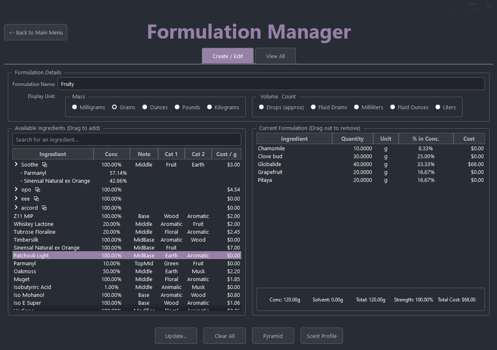

# Formul8

A desktop application for hobbyist and professional perfumers to create, manage, and analyze fragrance formulas.

## About The Project

Formul8 was created to provide a streamlined, offline tool for fragrance creation. It allows you to maintain a detailed library of your raw materials and build complex formulas with live analytical feedback, helping you understand the structure and cost of your creations instantly.

### Key Features

* **Ingredient Library:** Keep a detailed database of your aromatic materials, including concentration, cost, supplier, brand, and descriptive notes.
* **Formulation Creation:** Build formulas with a simple drag-and-drop interface.
* **Live Analysis:** Instantly see a formula's total cost, weight, and concentrate percentage as you build.
* **Visual Feedback:** Analyze your creations with a live-updating Scent Pyramid and Scent Profile chart.
* **Formula Scaling:** Easily scale your formulas to a new weight or factor, or normalize the concentrate to 100g.
* **Data Management:** Backup and restore your entire library and formula collection.
* **Exporting:** Export your ingredient library or individual formulas to clean PDF or TXT files.

## Technology Stack

* Python
* PyQt6

## License

This project is licensed under the **Creative Commons Attribution-NonCommercial-ShareAlike 4.0 International License**.

[![CC BY-NC-SA 4.0][cc-by-nc-sa-shield]][cc-by-nc-sa]

[cc-by-nc-sa]: http://creativecommons.org/licenses/by-nc-sa/4.0/
[cc-by-nc-sa-shield]: https://i.creativecommons.org/l/by-nc-sa/4.0/88x31.png

This means you are free to:

* **Share** — copy and redistribute the material in any medium or format
* **Adapt** — remix, transform, and build upon the material

Under the following terms:

* **Attribution** — You must give appropriate credit.
* **NonCommercial** — You may not use the material for commercial purposes.
* **ShareAlike** — If you remix, transform, or build upon the material, you must distribute your contributions under the same license as the original.